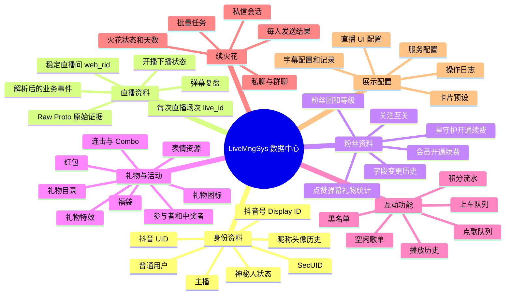
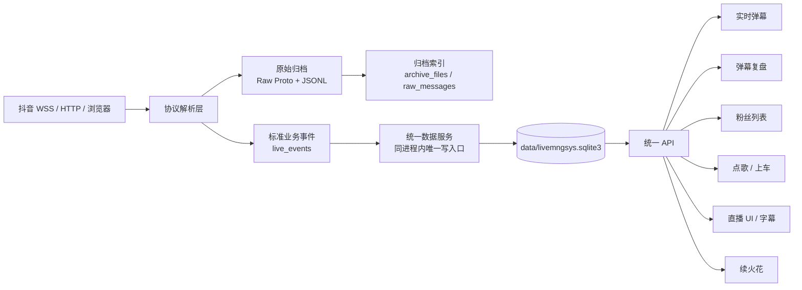
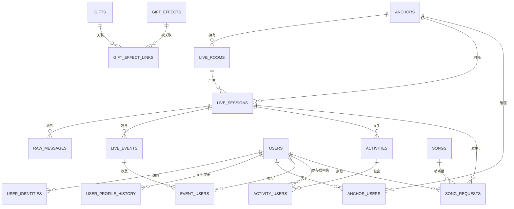
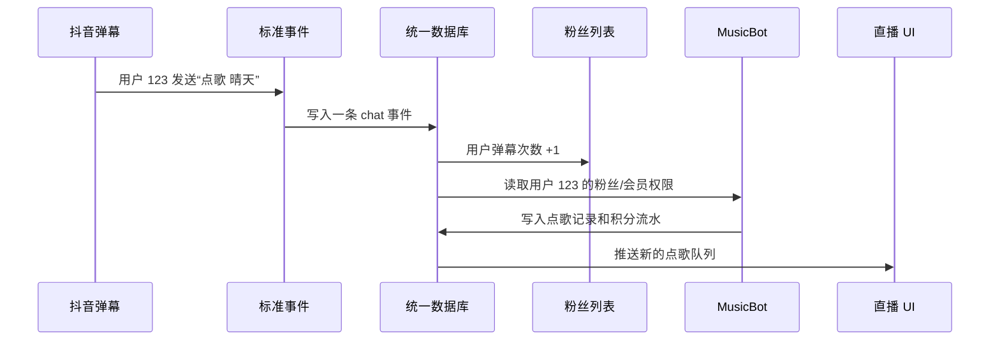
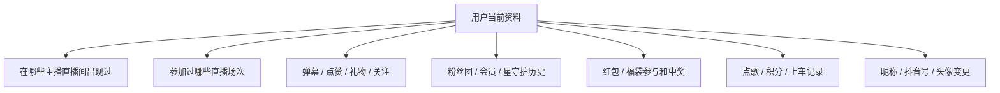

# LiveMngSys 统一数据库重构方案（小白版）

> 这份文档不要求你会编程。它先解释项目里有哪些数据，再说明怎样用一个统一数据库让各功能安全复用这些数据。
>
> 配套字段说明见：[LiveMngSys_统一数据库字段字典.md](./LiveMngSys_统一数据库字段字典.md)

## 一、先说结论

LiveMngSys 适合重构为：

- 一个统一数据库文件：`data/livemngsys.sqlite3`
- 多张有明确关系的数据表，而不是把所有内容塞进一张大表
- 主播、用户、直播间、直播场次只建立一次，其他功能通过内部 ID 关联
- 一位主播的数据仍然严格隔离，所有主播相关表都必须带 `anchor_id`（主播内部 ID）
- Raw Proto、礼物视频、歌曲、头像缓存等大文件继续存磁盘，数据库只保存路径、大小和校验值
- Cookie、登录令牌、浏览器 Profile 不写入普通业务数据库
- 页面和 MusicBot 不直接打开数据库，只通过后端 API 读写，避免锁库和字段各自解释

最重要的一句话是：

> 一份资料只保存一个“当前版本”，需要历史的字段另外记变更记录；其他功能都通过 ID 调用，不再复制昵称、头像、房间号等资料。

## 二、用文件柜理解数据库

可以把数据库想成一个文件柜：

| 数据库概念 | 小白理解 | 本项目例子 |
| --- | --- | --- |
| 数据库 | 整个文件柜 | `livemngsys.sqlite3` |
| 表 | 文件柜里的抽屉 | 用户表、场次表、礼物表 |
| 一行数据 | 一张档案卡 | 某个用户、某一场直播 |
| 主键 `id` | 档案卡内部编号 | 用户 1024、场次 88 |
| 外键 `user_id` | 指向另一张档案卡 | 这条弹幕是谁发的 |
| 索引 | 抽屉上的快速目录 | 按用户、场次、时间快速查找 |
| 唯一约束 | 禁止重复建档 | 同一个抖音 UID 不能重复建用户 |

“统一数据库”不是一张万能 Excel。把所有字段放在一张表里，会出现大量空白、重复和互相覆盖。正确方式是放在同一个数据库文件中，但按业务拆成多张表，再用 ID 建立关系。

## 三、项目数据总思维导图



## 四、现在的数据为什么难以复用

当前数据分散在多个地方：

| 当前位置 | 保存内容 | 当前问题 |
| --- | --- | --- |
| `DouyinListener/data/sessions/` | 场次、解析 JSON、Raw Proto | 适合留证据，但不适合跨场次快速查询 |
| `DouyinListener/data/fans/anchors/*.sqlite3` | 每位主播的粉丝数据库 | 主播隔离正确，但跨功能复用需要同时打开多个库 |
| `DouyinListener/data/gift_assets/gift_assets.sqlite3` | 礼物、特效、缓存记录 | 与弹幕礼物记录靠字符串 ID 临时关联 |
| `DouyinListener/data/config.json` | 监听、字幕、礼物更新配置 | 只有监听模块容易调用 |
| `MusicBot/Cache/Data/config.json` | 点歌配置和登录信息 | 与主系统配置分开 |
| `MusicBot/Cache/Data/state.json` | 用户、歌单、黑名单 | 用户资料与粉丝库重复 |
| 浏览器 `localStorage` | 直播 UI 配置、页面预设 | 换浏览器或设备后看不到 |
| `Doubao/browser_profile` | 弹幕登录态 | 浏览器专用资料，不能当业务数据库 |
| `Doubao/chat_profile` | 私信登录态 | 与弹幕登录态用途不同，必须独立保护 |
| 进程内存 | 实时弹幕、队列、会话、任务进度 | 重启后丢失，其他模块只能临时读取 |

主要重复包括：

- 同一用户的昵称、头像、抖音号同时存在于弹幕、粉丝库、点歌用户和续火花会话中
- 同一主播的 UID、SecUID、直播间号在配置、场次目录和粉丝库元数据中重复
- 礼物消息保存礼物名称和图片，礼物目录又保存一遍
- 红包、福袋的每一条状态消息可能重复保存整份活动资料
- 直播 UI 配置只在当前浏览器保存，无法被配置页、直播页共同管理

## 五、目标数据流



这里有三层数据，不能混为一谈：

1. 原始证据：抖音真实下发的 Raw Proto。协议补全后可以重新解析，不能被业务代码改写。
2. 标准事件：把协议字段整理成统一格式，例如“用户 A 在场次 B 发送礼物 C”。实时页面和复盘共用。
3. 业务结果：粉丝累计次数、当前会员状态、活动名单、积分余额等可查询结果。它们可以从标准事件重新计算。

优先级是：原始证据 > 标准事件 > 统计结果 > 页面临时状态。

## 六、最重要的身份关系

### 6.1 主播、直播间、场次不是同一个东西


| 名称 | 含义 | 是否经常变化 | 正确用途 |
| --- | --- | --- | --- |
| 主播 UID / SecUID | 主播账号身份 | 很少变化 | 区分主播数据库边界 |
| 抖音号 `display_id` | 人能看懂的账号名 | 可以修改 | 展示和搜索，不能单独当永久主键 |
| 直播间号 `web_rid` | `live.douyin.com/这里` 的稳定编号 | 通常稳定 | 监控是否开播、找到直播间 |
| 场次号 `live_id` | 每次开播产生的长编号 | 每场变化 | 归档一次直播、复盘一次直播 |

数据库内部再给它们各自分配 `anchor_id`、`room_id`、`session_id`。页面看到的抖音编号仍保留，但表之间只用内部 ID 关联。

### 6.2 用户不能靠昵称识别

同一个用户可以改昵称、改抖音号，也可能开启神秘人。用户识别顺序建议为：

1. 抖音 UID
2. SecUID
3. Display ID
4. 如果只有临时匿名标识，建立“待合并身份”，不能按昵称强行合并

`users` 保存用户当前资料，`user_identities` 保存这个用户曾经出现过的各种平台 ID，`user_profile_history` 保存昵称、头像、Display ID 等变更记录。

这样粉丝列表、点歌、上车、礼物、活动名单都可以引用同一个 `user_id`。

### 6.3 神秘人身份的实际观测结论

从现有场次 Raw Proto 解析结果中观察到，神秘人并不是始终没有身份字段：

| 观测情况 | 携带字段 | 处理方式 |
| --- | --- | --- |
| 普通神秘人消息 | `id`、`secUid`、`displayId`、`shortId`、`idStr` | 可以在当前数据范围内建立强身份关联 |
| 部分榜单神秘人 | 只有 `id` 和 `idStr`，没有 `secUid`、`displayId` | 使用场次范围内的临时身份，不直接跨场次合并 |
| 哨兵身份 | `id=111111`，被多个不同昵称和多个 `idStr` 共用 | 绝对不能用 `id=111111` 建用户主档 |
| 头像信息 | 有时是真实头像，有时是 `mystery_man` 占位图 | 真实头像只能辅助比对，不能作为主键 |
| `secret=1` | 普通用户和神秘人都可能出现 | 只能作为隐私相关字段，不能单独判定神秘人 |

因此神秘人身份应增加“作用范围”和“可信度”：

- `id` 为正常非哨兵值，并且 `secUid` 或 `displayId` 同时存在：强身份，允许在同一主播下跨场次关联
- 只有 `idStr`：临时身份，默认只在 `anchor_id + session_id` 范围内关联
- `id=111111`、空 UID 或字段互相冲突：匿名占位身份，只保存活动和场次记录，不进入全局用户合并
- 昵称、`teamIdStr`、消费等级、关注数和头像哈希：只作为历史观察字段

这意味着“神秘人列表”应该展示可追踪的匿名档案，但不能承诺把神秘人还原成真实账号。只有之后捕获到可信的跨模式身份对应关系，才允许人工确认合并。

## 七、统一数据库的抽屉划分

### 7.1 第一阶段必须建立的核心表

| 表名 | 中文名称 | 保存什么 | 谁会调用 |
| --- | --- | --- | --- |
| `anchors` | 主播表 | 主播账号当前资料 | 配置、监听、粉丝库、复盘 |
| `live_rooms` | 直播间表 | 稳定直播间号和当前状态 | 开播监控、监听配置 |
| `live_sessions` | 直播场次表 | 每次开播的起止时间和归档目录 | 复盘、统计、粉丝记录 |
| `users` | 用户表 | 用户当前资料，只保存一份 | 所有互动功能 |
| `user_identities` | 用户平台身份表 | UID、SecUID、Display ID 的对应关系 | 用户去重和身份合并 |
| `user_profile_history` | 用户资料变更表 | 昵称、头像、抖音号等历史 | 粉丝详情、神秘人追踪 |
| `anchor_users` | 主播与用户关系表 | 某用户在某主播下的粉丝、会员、守护状态 | 粉丝列表、权限、点歌 |
| `live_events` | 标准直播事件表 | 弹幕、点赞、礼物、关注等统一事件 | 实时页、复盘、统计 |
| `raw_messages` | 原始消息索引表 | Raw Proto/JSON 文件路径和解析状态 | 协议排错、重新解析 |
| `event_users` | 事件人员关系表 | 事件中的发送者、参与者、中奖者 | 福袋、红包、榜单 |
| `activities` | 活动表 | 一个完整红包或福袋生命周期 | 实时活动抽屉、复盘 |
| `activity_users` | 活动人员表 | 参与者、中奖者、奖励 | 活动详情 |
| `settings` | 统一配置表 | 各模块配置，按全局/主播/设备分级 | 配置页、监听、MusicBot |
| `schema_migrations` | 数据库版本表 | 数据库升级到了哪一版 | 安全升级和回退 |

### 7.2 第二阶段接入的资源和业务表

| 表名 | 中文名称 | 保存什么 | 谁会调用 |
| --- | --- | --- | --- |
| `gifts` | 礼物目录表 | 礼物 ID、名称、价值 | 弹幕礼物、统计、预览 |
| `gift_effects` | 礼物特效表 | 特效 ID 和资源类型 | 特效更新、直播 UI |
| `media_assets` | 媒体资源表 | 图片、视频、音频本地路径和哈希 | 礼物、表情、头像、歌曲封面 |
| `gift_effect_links` | 礼物特效关系表 | 一个礼物可关联哪些特效 | 礼物预览 |
| `emojis` | 表情表 | 普通和合成表情名称与图片 | 实时弹幕、复盘 |
| `songs` | 歌曲表 | 歌曲基础资料，只保存一次 | 点歌、歌单、黑名单 |
| `playlists` | 歌单表 | 空闲歌单和导入歌单 | MusicBot |
| `playlist_songs` | 歌单歌曲关系表 | 某首歌属于哪个歌单 | MusicBot |
| `song_requests` | 点歌记录表 | 谁在什么场次点了哪首歌 | 点歌列表、粉丝详情、积分 |
| `playback_history` | 播放历史表 | 实际播放结果 | 已播列表、统计 |
| `song_blacklist` | 歌曲黑名单表 | 禁止播放的歌曲及原因 | 点歌审核 |
| `point_ledger` | 积分流水表 | 每次加分和扣分，不直接改历史 | 点歌费用、互动奖励 |

### 7.3 第三阶段接入的工具与展示表

| 表名 | 中文名称 | 保存什么 | 谁会调用 |
| --- | --- | --- | --- |
| `im_conversations` | 私信会话表 | 群聊/私聊、火花状态、天数 | 批量续火花 |
| `spark_tasks` | 续火花任务表 | 一次批量任务的总状态 | 任务进度和历史 |
| `spark_task_items` | 续火花任务明细表 | 每个会话发送成功或失败 | 失败重试、日志 |
| `queue_entries` | 通用排队表 | 上车等排队业务；点歌仍用专表 | 上车 UI、直播 UI |
| `caption_records` | 字幕记录表 | 字幕正文和时间范围 | 直播 UI、复盘 |
| `ui_presets` | 页面预设表 | 直播 UI、卡片和主题配置 | 多设备共享配置 |
| `operation_logs` | 操作日志表 | 保存配置、启动任务、导入导出等 | 排错和审计 |
| `schema_dictionary` | 中文字段字典表 | 表和字段的中文解释 | 管理页、导出文档 |

## 八、核心表关系图



## 九、哪些数据可以互相调用

| 共享数据 | 可以被哪些功能复用 | 复用方式 |
| --- | --- | --- |
| `users` 用户资料 | 实时弹幕、粉丝列表、点歌、上车、活动名单 | 都保存同一个 `user_id` |
| `anchor_users` 主播关系 | 粉丝筛选、点歌权限、上车优先级、直播 UI 徽章 | 用 `anchor_id + user_id` 查询 |
| `live_sessions` 场次 | 复盘、礼物统计、字幕、点歌历史、活动历史 | 都保存同一个 `session_id` |
| `live_events` 标准事件 | 实时显示、复盘、粉丝累计、积分规则 | 只解析一次，多功能订阅同一事件 |
| `gifts` 礼物目录 | 礼物消息、礼物价值、礼物特效、复盘 | 礼物事件只保存 `gift_id` 和当时数量 |
| `activities` 活动 | 实时右上角记录、完整生命周期、复盘 | 同一活动 ID 持续更新同一行 |
| `media_assets` 媒体文件 | 礼物图标、特效、表情、头像缓存 | 按 URL 或 SHA256 去重 |
| `point_ledger` 积分流水 | 弹幕加分、点歌扣分、上车奖励 | 每次变化记一笔，可重算余额 |
| `settings` 配置 | 配置页、监听、字幕、点歌、直播 UI | 按作用范围和模块读取 |
| `ui_presets` 页面预设 | 配置页和直播 UI | 不再依赖某一台设备的 localStorage |

一个典型例子：



用户资料没有复制三次，三个功能都引用同一个用户。

## 十、哪些内容不应该塞进数据库

| 内容 | 正确保存位置 | 数据库保存什么 |
| --- | --- | --- |
| Raw Proto 二进制 | `data/archive/.../proto/` | 文件路径、消息 ID、大小、SHA256 |
| 每场解析 JSONL | `data/archive/.../parsed.jsonl` | 场次路径、条数、时间范围 |
| 礼物特效视频 | `data/media/gift-effects/` | 特效 ID、本地路径、格式、哈希 |
| 歌曲音频 | `MusicBot/Cache/Music/` 或统一媒体目录 | 歌曲 ID、本地路径、缓存状态 |
| 图片和封面 | `data/media/images/` | URL、本地路径、哈希 |
| 浏览器登录 Profile | 现有独立 Profile 目录 | 只保存“登录状态摘要”，不保存 Cookie 明文 |
| 临时实时队列 | 进程内存 | 需要恢复的关键动作才写业务表 |

这样做能同时节省数据库体积和查询开销。

## 十一、节省开销的具体规则

### 11.1 只保存一份公共资料

- 弹幕事件不重复保存完整用户对象，只保存 `user_id`
- 礼物事件不重复保存礼物图标列表，只保存 `gift_id`
- 点歌记录不复制歌曲全部资料，只保存 `song_id`
- 活动的状态更新写入同一个 `activity_id`，不为倒计时每秒新建完整活动
- 昵称等易变字段在 `users` 保存当前值，在历史表保存变化，不在每张业务表复制

### 11.2 原始消息去重

建议唯一键：

`session_id + method + msg_id`

如果某协议没有可靠 `msg_id`，再使用：

`session_id + method + 关键业务 ID + 时间窗口 + 内容哈希`

不能只用昵称、文本和秒级时间去重，否则连击礼物、重复弹幕和活动状态可能被误删。

### 11.3 热数据和冷数据分开

- 热数据：当前场次最近几百条消息、当前队列、当前活动，放内存并通过 WebSocket 推送
- 温数据：场次、粉丝、点歌、活动摘要，放 SQLite 供页面查询
- 冷数据：Raw Proto、完整 JSONL、历史媒体，放压缩归档目录

一场直播结束后可以生成索引并压缩 `proto/`、`json/`，但必须先校验归档可读，不能直接删除原始证据。

### 11.4 不把高频状态反复写盘

以下数据不应每 100ms 写数据库：

- 字幕轮询状态
- 播放进度
- 在线人数瞬时刷新
- WebSocket 连接心跳
- 页面滚动位置

只有内容发生变化、达到采样间隔或场次结束时才持久化。

### 11.5 索引只建在常用查询上

第一批建议索引：

- 场次：`anchor_id + started_at`
- 事件：`session_id + event_at`
- 用户身份：`identity_type + identity_value` 唯一索引
- 主播粉丝：`anchor_id + user_id` 唯一索引
- 粉丝列表：`anchor_id + last_seen_at`
- 活动：`session_id + platform_activity_id` 唯一索引
- 点歌记录：`session_id + requested_at`

索引不是越多越好。每多一个索引，写入时就多维护一份目录。

## 十二、统一配置应该怎样保存

`settings` 表使用三层作用范围：

| 作用范围 | 示例 | 含义 |
| --- | --- | --- |
| `global` 全局 | 服务端口、数据目录 | 整个项目共用 |
| `anchor` 主播 | 监听房间、粉丝规则、礼物刷新 | 只对某位主播生效 |
| `device` 设备 | 某台直播电脑的音频设备 | 不能跨设备照搬 |

配置值可以保存为 JSON，但每项配置必须有固定键名和类型校验。例如：

| module | config_key | 中文含义 |
| --- | --- | --- |
| `listener` | `transport` | 弹幕监听方式 |
| `listener` | `save_raw` | 是否保存 Raw Proto |
| `captions` | `fallback_timeout_seconds` | 字幕回退超时秒数 |
| `gift_assets` | `refresh_hours` | 礼物特效刷新间隔 |
| `musicbot` | `request_cost` | 点歌需要的积分 |
| `live_ui` | `caption_font_size` | 直播字幕字号 |

密码、Cookie、Token 不进入这张表。数据库备份通常会被复制，明文凭证会带来安全风险。

## 十三、建议的程序调用边界

为了避免 SQLite 被 Python、Node.js 和多个页面同时写坏，建议只有一个“统一数据服务”拥有写权限。

第一阶段不增加新进程，可以把它作为现有 `DouyinListener` Python 服务里的 `DataRepository` 模块：

```text
抖音监听 -> DataRepository -> SQLite
MusicBot -> HTTP API -> DataRepository -> SQLite
GUIDemo -> HTTP/WebSocket -> DataRepository -> SQLite
直播 UI -> HTTP/WebSocket -> DataRepository -> SQLite
```

规则如下：

- 前端永远不直接访问数据库文件
- MusicBot 不直接打开 SQLite，避免 Python 与 Node.js 同时写锁冲突
- WebServer 继续只做统一入口和代理
- 所有写入使用事务，一组相关更新要么全部成功，要么全部失败
- 开启 SQLite `WAL`、`foreign_keys` 和 `busy_timeout`
- 所有 API 返回稳定字段，前端不直接依赖 Raw Proto 字段名

## 十四、迁移顺序

不要一次性把全部模块改完。推荐按下面顺序，每一步都可以独立验收和回退。

### 第 0 步：只建立新库，不改旧功能

- 创建 `data/livemngsys.sqlite3`
- 建立 `schema_migrations` 和 `schema_dictionary`
- 新库只读测试，旧数据继续运行

### 第 1 步：统一主播、直播间、场次、用户

- 导入现有按主播粉丝库
- 导入场次 `session.json`
- 建立用户身份去重规则
- 页面仍读取旧 API，后台进行双写比对

验收：同一个用户在多场直播中只对应一个 `user_id`，但不同主播通过 `anchor_id` 保持隔离。

### 第 2 步：统一标准事件和复盘索引

- 新消息写 `live_events` 和 `raw_messages`
- 旧的 Raw Proto、JSONL 归档保持不变
- 复盘列表优先查数据库索引，不再每次扫描整个场次目录

验收：场次选择能立即展开，加载时间不随历史文件数量线性增长。

### 第 3 步：迁移粉丝、礼物、红包和福袋

- 粉丝统计由统一事件更新
- 礼物事件关联统一礼物目录
- 红包和福袋分别写 `activities`，不能仅按“抽奖”文字混合分类
- 参与者和中奖者写 `activity_users`

验收：实时页面和复盘显示同一份活动详情。

### 第 4 步：迁移 MusicBot 和积分

- 导入歌曲、歌单、黑名单、点歌用户
- MusicBot 用户映射到统一 `users`
- 所有加分扣分写 `point_ledger`

验收：粉丝身份、会员、星守护权限可以直接影响点歌规则，无需复制用户资料。

### 第 5 步：迁移续火花、字幕和 UI 配置

- 会话和任务结果进入统一库
- 浏览器 Profile 保持独立
- localStorage 配置迁移到 `ui_presets`，localStorage 只做离线缓存

验收：换设备后仍能加载配置，停止任务后可查看历史并重试失败项。

### 第 6 步：关闭旧数据写入

- 双写稳定一段时间后逐项关闭旧 JSON/旧 SQLite 写入
- Raw Proto 和严格场次归档不能关闭
- 生成迁移报告：总行数、失败数、无法识别身份数、文件校验失败数

## 十五、最小可行版本

如果暂时没有精力做完整重构，先实现下面 8 张表就能解决大部分重复和复盘卡顿：

1. `anchors`
2. `live_rooms`
3. `live_sessions`
4. `users`
5. `user_identities`
6. `anchor_users`
7. `live_events`
8. `raw_messages`

然后把场次列表从“扫描每个 `parsed.jsonl`”改成直接查询 `live_sessions`，这是最直观的性能收益。

## 十六、重构时不能破坏的规则

- 直播间号 `web_rid` 和场次号 `live_id` 必须分开
- 红包和福袋必须分开，即使它们都有参与和开奖过程
- 用户不能靠昵称去重
- 一个主播的数据不能混入另一个主播，查询必须带 `anchor_id`
- Raw Proto 是协议问题的最终证据，不能用整理后的 JSON 替代
- 解析不确定时保留 `unknown`，不能靠猜测补业务类型
- 所有计数都应能追溯到事件或流水，不能只保存一个无法解释的总数
- 删除用户资料时，原始场次证据和业务审计记录要按明确的数据保留策略处理
- 数据库升级必须有版本号和迁移脚本，不能直接手改生产库字段
- 备份时应同时备份 SQLite、归档索引和媒体清单，而不是只复制数据库文件

## 十七、最终希望达到的效果

重构完成后，从任何页面点击一个用户，都应该能沿着同一个 `user_id` 看到：



从任何一场直播，也应该能沿着同一个 `session_id` 看到弹幕、礼物、活动、字幕、点歌和粉丝变化，而不再去多个文件夹和多个数据库拼接。

这才是“数据只存一份，功能互相调用”的真正目标。
