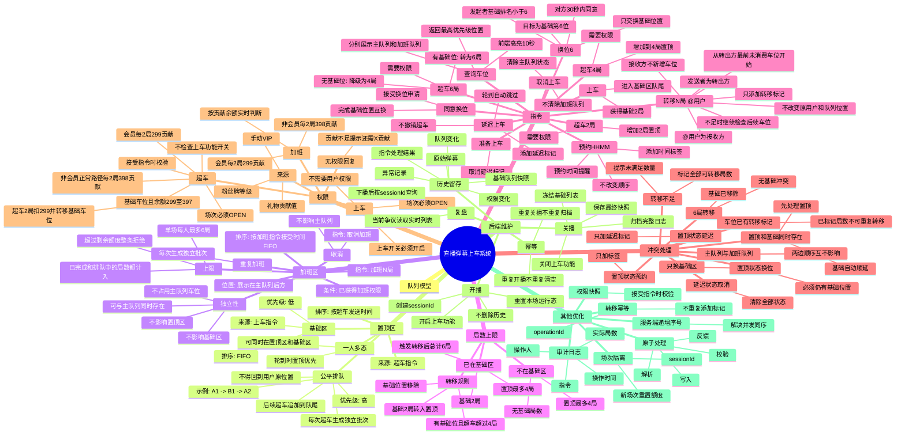

# 上车规则脑图

下面是 Mermaid mindmap 格式，可直接复制到支持 Mermaid 的 Markdown 编辑器或文档工具中查看。

```mermaid
mindmap
  root((直播弹幕上车系统))
    队列模型
    置顶区
      来源: 超车指令
      排序: 按超车发送时间
      公平排队
        每次超车生成独立批次
        后续超车追加到队尾
        不得回到用户原位置
        示例: A1 -> B1 -> A2
        优先级: 高
      基础区
        来源: 上车指令
        排序: FIFO
        优先级: 低
      一人多态
        可同时在置顶区和基础区
        轮到时置顶优先
    加班区
      指令: 加班N局
      条件: 已获得加班权限
      排序: 按加班指令接受时间FIFO
      位置: 展示在主队列后方
      独立性
        不影响基础区
        不影响置顶区
        不占用主队列车位
        可与主队列同时存在
      上限
        单场每人最多6局
        已完成和排队中的局数都计入
        超过剩余额度整条拒绝
      重复加班
        每次生成独立批次
      取消
        指令: 取消加班
        不影响主队列
    局数上限
      已在基础区
        基础2局
        置顶最多4局
        触发转移后总计6局
      不在基础区
        无基础局数
        置顶最多4局
      转移规则
        有基础位且超车超过4局
        基础2局转入置顶
        基础位置移除
    指令
      上车
        进入基础区队尾
        获得基础2局
      超车2局
        需要权限
        增加2局置顶
      超车4局
        需要权限
        增加到4局置顶
      超车6局
        需要权限
        有基础位: 转为6局
        无基础位: 降级为4局
      预约HHMM
        添加时间标签
        不改变顺序
        预约时间提醒
      换位6
        发起者基础排名小于6
        目标为基础第6位
        对方30秒内同意
        只交换基础位置
      同意换位
        接受换位申请
        完成基础位置互换
      延迟上车
        添加延迟标记
        轮到自动跳过
        不撤销超车
      准备上车
        取消延迟标记
      取消上车
        清除主队列状态
        不清除加班队列
      查询车位
        返回最高优先级位置
        前端高亮10秒
        分别展示主队列和加班队列
      转移N局 @用户
        发送者为转出方
        @用户为接收方
        从转出方最前未消费车位开始
        不足时继续检查后续车位
        只添加转移标记
        不改变原用户和队列位置
        接收方不新增车位
    冲突处理
      置顶和基础同时存在
        先处理置顶
        基础自动顺延
      6局转移
        基础已移除
        无基础冲突
      置顶状态预约
        只加标签
      置顶状态延迟
        只加延迟标记
      置顶状态换位
        必须仍有基础位置
        只换基础区
      延迟状态取消
        清除全部状态
      转移不足
        标记全部可转移局数
        提示未满足数量
      车位已有转移标记
        已标记局数不可重复转移
      主队列与加班队列
        两边顺序互不影响
    权限
      上车
        不需要用户权限
        场次必须OPEN
        上车开关必须开启
      超车
        场次必须OPEN
        不检查上车功能开关
        会员每2局299贡献
        非会员正常路径每2局398贡献
        基础车位且余额299至397
          超车2局扣299并转移基础车位
        接受指令时校验
      加班
        按贡献余额实时判断
        会员每2局299贡献
        非会员每2局398贡献
      来源
        粉丝牌等级
        礼物贡献值
        手动VIP
      无权限回复
        贡献不足提示还需X贡献
    后端维护
      开播
        创建sessionId
        重置本场运行态
        开启上车功能
        不删除历史
      关播
        关闭上车功能
        冻结基础列表
        保存最终快照
        归档完整日志
      幂等
        重复开播不重复清空
        重复关播不重复归档
      历史留存
        基础队列快照
        原始弹幕
        指令处理结果
        队列变化
        权限变化
        异常记录
      复盘
        当前争议读取实时列表
        下播后按sessionId查询
    其他优化
      服务端递增序号
        解决并发同序
      原子处理
        解析
        校验
        写入
        反馈
      转移幂等
        operationId
        不重复添加标记
      权限快照
        接受指令时校验
      场次隔离
        sessionId
        新场次重置额度
      审计日志
        指令
        操作人
        实际局数
        操作时间
```
